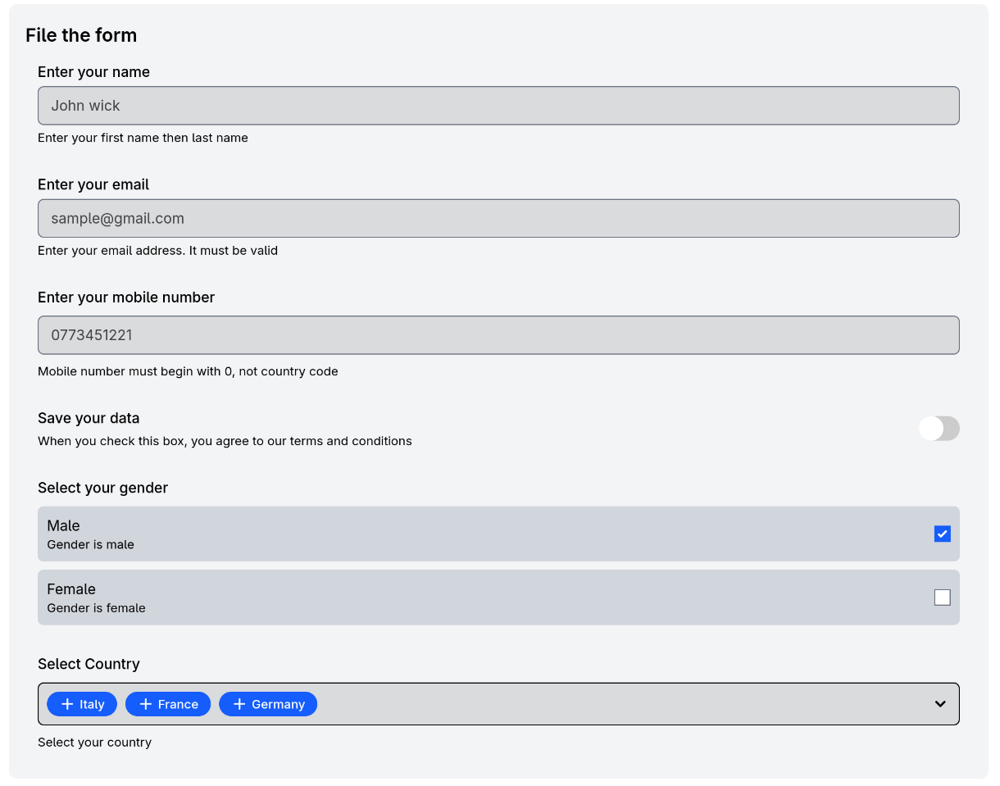

# QuickForm

Why to build complex dynamic forms declaratively. Using schema and classes for fields of inputs giving real time validation,
pre-processing and post-processing.



```ts
<script lang="ts">
	import type { QuickFormSchema } from '$lib/types/schema.js';
	import { TextState } from '$lib/components/Text/TextState.svelte.js';
	import QuickFormBuilder from '$lib/compileFormSchema/QuickFormBuilder.svelte';
	import { TextValidation } from '$lib/components/Text/Text.validation.js';
	import { NumberState } from '$lib/components/Numbers/NumberState.svelte.js';
	import { NumberValidation } from '$lib/components/Numbers/Number.validation.js';
	import { BooleanState } from '$lib/components/Boolean/BooleanState.svelte.js';
	import { BooleanValidation } from '$lib/components/Boolean/Boolean.validation.js';
	import { ChoicesState } from '$lib/components/Choices/ChoicesState.svelte.js';
	import { SelectState } from '$lib/components/Select/SelectState.svelte.js';

	class nameInput extends TextState {
		override validation() {
			return new TextValidation(this.text).minLength(3).maxLength(10);
		}
	}

	class emailInput extends TextState {}

	class ageInput extends NumberState {
		override validation() {
			return new NumberValidation(this.number).min(18).max(100);
		}
	}

	class saveButton extends BooleanState {
		override validation() {
			return new BooleanValidation(this.boolean).mustBeTrue();
		}
	}

	class genderInput extends ChoicesState {}

	class countryInput extends SelectState {}

	const entries: [string, TextState | NumberState | BooleanState | ChoicesState | SelectState][] = [
		['name', new nameInput({
			label: "Enter your name",
			helper: 'Enter your first name then last name',
			placeholder: 'John wick',
		})],
		['email', new emailInput({
			label: "Enter your email",
			helper: 'Enter your email address. It must be valid',
			placeholder: 'sample@gmail.com',
		})],
		['age', new ageInput({
			label: "Enter your mobile number",
			helper: 'Mobile number must begin with 0, not country code',
			placeholder: '0773451221',
		})],
		['save', new saveButton({
			label: "Save your data",
			helper: 'When you check this box, you agree to our terms and conditions',
		})],
		['gender', new genderInput({
			label: "Select your gender",
			multiple: false,
			choices: [
				{
					title: "Male",
					helper: "Gender is male",
					key: "male",
					value: false
				},
				{
					title: "Female",
					helper: "Gender is female",
					key: "female",
					value: false
				}
			],
			defaultSelect: 'male'
		})],
		['country', new countryInput({
			label: 'Select Country',
			helper: 'Select your country',
			placeholder: 'Select Country',
			select: [
				{ label: 'USA', value: 'USA' },
				{ label: 'United Kingdom', value: 'UK' },
				{ label: 'Canada', value: 'CA' },
				{ label: 'Germany', value: 'DE' },
				{ label: 'France', value: 'FR' },
				{ label: 'Italy', value: 'IT' },
				{ label: 'Spain', value: 'ES' },
				{ label: 'Australia', value: 'AU' },
				{ label: 'Japan', value: 'JP' },
				{ label: 'China', value: 'CN' },
				{ label: 'India', value: 'IN' },
				{ label: 'Brazil', value: 'BR' }
			],
			multiple: true,
			defaultSelect: 'USA'
		})]
	];
	const quickForm: QuickFormSchema = new Map(entries);
</script>
```
```sveltehtml
<div class="mx-64 my-16 p-4 bg-gray-100 rounded-lg">
	<p class="text-lg font-semibold">File the form</p>
	<QuickFormBuilder schema={quickForm} />
</div>
```

## Why use classes

Because it gives you full control over the state of the form, validation, processing in the same place. This makes complex forms easy to work with.

